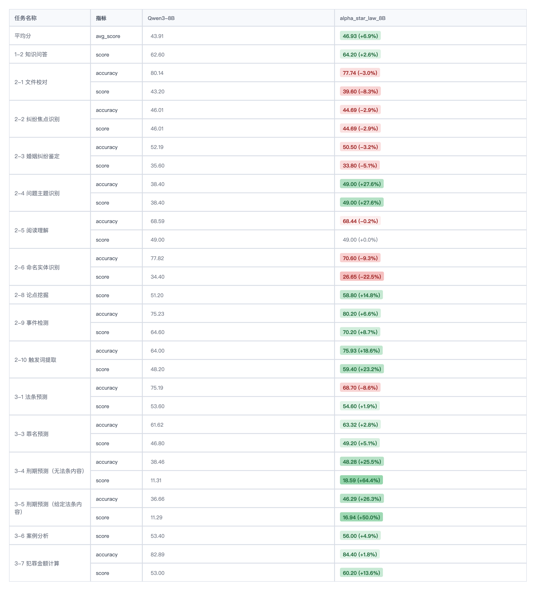

# 🪐 AlphaStarLaw - 中文法律大模型(律启星辰)

## 简介

&emsp;&emsp;欢迎来到 AlphaStarLaw。在法律这个严谨的领域，我们相信 AI 不应只是“聊天工具”，而应成为“专业助手”。我们始终坚信：**以技术普惠法治，以范式定义可信**。

### 🛠 我们在做什么？

- 🔥 **法律大模型调优（Legal-Tuning-Cookbook）**：系统梳理和探索法律大模型从**增量预训练（Continue Pre-training）-> 全量指令微调（Full SFT）-> RLHF**的技术方案。深度研究如何平衡通用能力与法律专业知识，避免模型在学习法律知识后出现“**灾难性遗忘**”、“**指令退化**”、“**模式坍塌**”。

- 🔥 **可信训练范式（Credible-Tuning Paradigm）**：针对大模型的后训练方法和技巧公开资料较少，我们针对法律场景对数据工程、训练范式进行原创性探索，**成功的探索出了大模型在各个阶段极具可移植性的训练范式**。输出一套标准化的训练模组，让“可信 AI”在不同垂直领域生根发芽。针对法律领域的特性，我们开发了一套 **“证据增强+逻辑链约束+参数动态调优”** 的可信训练方式。通过在损失函数中引入法理逻辑一致性惩罚以及在训练过程中进行参数动态调优、数据学习难度动态评估，并结合法律知识图谱（KG）实时校验，从根源上抑制了模型的“**事实性幻觉**”、“**模式坍塌**”。

- 🔥 **多维度性能评估（Multi-Dimensional Performance Benchmarking）**：多维度多数据集评测，自研模型在中文法律基准测试（如 LawBench、LexEval、CAIL）中的表现远超同参数规模的基线模型（Baseline）并且通用能力未发生衰减。在多项核心任务上，该模型展现出了跨越量级的竞争力，其实际表现甚至超越了参数量远大于自身的通用大模型。在案情分析、罪名预测及法律文书生成等关键任务上，其准确率与逻辑严密性甚至优于部分闭源商业模型。

## 模型性能
所有的测试结果详情参考log日志。

### [LawBench](https://github.com/open-compass/LawBench) 数据集
1. 已有开源模型以及测试结果详情参考 [OpenCompass LawBench](https://github.com/open-compass/LawBench) 
2. 展示我们经过调优模型和基线模型以及其他不同尺寸模型的性能。

3. 模型和基线模型的性能对比图如下：


#### 结论

### [LexEval](https://github.com/CSHaitao/LexEval/tree/main) 数据集
1. 展示我们经过调优模型和基线模型以及其他不同尺寸模型的性能。

2. 模型和基线模型的性能对比图如下：

#### 结论

### 如何评估模型的性能
我们在 [LegalKit](https://github.com/DavidMiao1127/LegalKit) 的基础上对评估脚本进行了深度优化，并提供了详细的日志，方便用户快速评估模型性能。为了方便对比不同模型的具体指标性能，我们提供了 **模型评估看板** 方便用户快速查看模型在不同任务上的具体性能。
#### 评估脚本

```bash

law-eval.shTIMESTAMP=$(date -d "+8 hours" +"%m%d_%H%M%S")
DATASET_NAME="LawBench"
# DATASET_NAME="LexEval"
MODEL_NAME="Qwen8B-off-policy-fintuned"

export CUDA_DEVICE_ORDER=PCI_BUS_ID
export NCCL_DEBUG=INFO

export CUDA_VISIBLE_DEVICES=0,1

# 
python legalkit/main.py \
  --models  ${MODEL_NAME} \
  --datasets ${DATASET_NAME} \
  --accelerator vllm \
  --max_tokens 4096 \
  --num_workers 1 \
  --tensor_parallel 2 \
  --batch_size 32 \
  --temperature 0.1 \
  --top_p 0.9 \
  2>&1 | tee ${DATASET_NAME}_${TIMESTAMP}.log

```
#### 模型评估看板

1. python /mnt/public/haoduo/code/LegalKit-main/score_all.py  
2. python /mnt/public/haoduo/code/LegalKit-main/benchmark.py --port 8088

## 数据集
### 数据收集
&emsp;&emsp;数据集主要来自3方面：
    1. 网络开源数据集，例如：国家法律法规数据库、裁判文书网、法律问答网站、中文书籍等；
    2. 法律问答、合成数据集，利用模型对query进行改写和扩充；
    3. 英文法律数据集；
    4. 内部标注数据集；
### 数据处理

## 模型微调训练
### CPT（Continual Pre-training）
&emsp;&emsp;增量预训练（Continue Pre-training）是针对大模型在已有预训练基础上，进一步预训练，提升模型在法律领域的表现。
```bash
训练源码待补充
```
### SFT（Supervised Fine-tuning）
&emsp;&emsp;全量指令微调（Full SFT）是针对大模型在已有预训练基础上，进一步预训练，提升模型在法律领域的表现。
```bash
训练源码待补充
```
### RLHF（Reinforcement Learning from Human Feedback）
&emsp;&emsp;指令微调（Instruction Tuning）是针对大模型在已有预训练基础上，进一步预训练，提升模型在法律领域的表现。
```bash
训练源码待补充
```
## 致谢
本项目参考了以下开源项目，在此对相关项目和研究开发人员表示感谢。

1. LawBench: https://github.com/open-compass/LawBench
2. LexEval: https://github.com/THUDM/LexEval
3. legalbench: https://github.com/HazyResearch/legalbench
4. LegalOne-R1: https://github.com/THUIR/LegalOne-R1
5. DISC-LawLLM: https://github.com/FudanDISC/DISC-LawLLM

同样感谢其他限于篇幅未能列举的为本项目提供了重要帮助的工作。


# Todo
- [ ] 开源数据集及相关数据工程代码
- [ ] 开源相关训练代码

# 参与讨论
&emsp;&emsp;我们诚邀开发者与法律科技专家共同探索法律大模型的边界。如需获取模型权重测试、训练脚本细节或进行Benchmark 对标测试，请致信：📧 wjianxz@163.com

本项目遵循MIT许可证。

