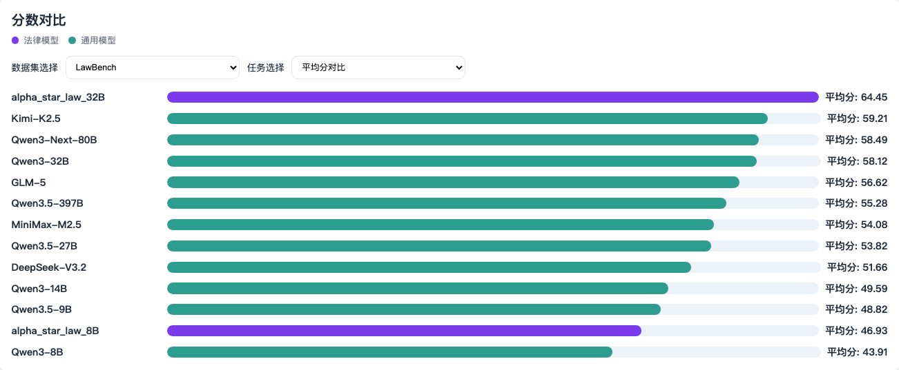
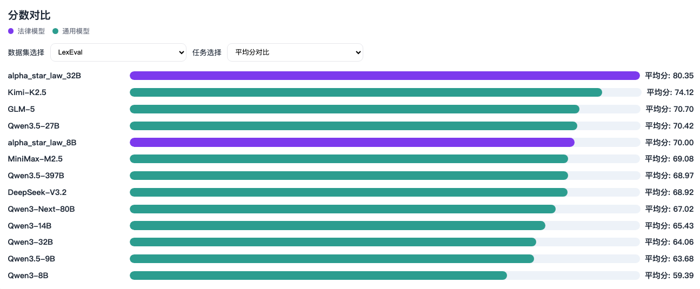
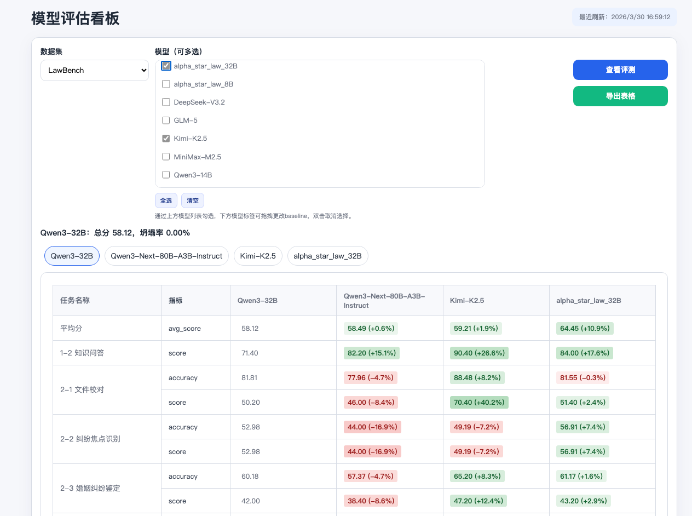

# 🪐 AlphaStarLaw - 中文法律大模型(律启星辰)

## 简介

&emsp;&emsp;欢迎来到 AlphaStarLaw。在法律这个严谨的领域，我们相信 AI 不应只是“聊天工具”，而应成为“专业助手”。我们始终坚信：**以技术普惠法治，以范式定义可信**。在 AlphaStarLaw 的研发中，通过构建多轮对话数据集和精细化参数调优，使模型在法律咨询、事实验证、阅读理解、关系抽取、文书生成等专业性显著提升。通过引入 **思维链(CoT)** 训练，成功强化了模型在复杂案情分析中的多步推理能力，实现了法律知识与生成逻辑的深度融合。

### 🛠 我们在做什么？

- 🔥 **法律大模型调优（Legal-Tuning-Cookbook）**：系统梳理和探索法律大模型从**增量预训练（Continue Pre-training）-> 全量指令微调（Full SFT）-> RLHF**的技术方案。深度研究如何平衡通用能力与法律专业知识，避免模型在学习法律知识后出现“**灾难性遗忘**”、“**指令退化**”、“**模式坍塌**”。

- 🔥 **可信训练范式（Credible-Tuning Paradigm）**：针对大模型的后训练方法和技术公开资料较少，我们针对法律场景对数据工程、训练范式进行原创性探索，**成功的探索出了大模型在各个阶段极具可移植性的训练范式**。输出一套标准化的**训练模组**，让“可信 AI”在不同垂直领域生根发芽。针对法律领域的特性，我们开发了一套 **“数据演进+证据增强+逻辑链约束+参数动态调优”** 的可信训练方式。通过在损失函数中引入法理逻辑一致性惩罚以及在训练过程中进行参数动态调优、训练数据学习难度动态评估，并结合法律知识图谱（KG）实时校验，从根源上抑制了模型的“**事实性幻觉**”、“**模式坍塌**”并显著提升模型性能。

- 🔥 **多维度性能评估（Multi-Dimensional Performance Benchmarking）**：多维度多数据集评测，自研模型在中文法律基准测试（如 LawBench、LexEval、CAIL）中的表现远超同参数规模的基线模型（Baseline）并且通用能力未发生衰减。在多项核心任务上，该模型展现出了跨越量级的竞争力，其实际表现甚至超越了参数量远大于自身的通用大模型。在案情分析、罪名预测及法律文书生成等关键任务上，其准确率与逻辑严密性甚至优于部分闭源商业模型。模型的模式坍塌现象得到了有效缓解，在生成任务上，重复性得到了显著降低。

- 🔥 **多轮对话数据集（Multi-Turn Dialogue Dataset）**：利用Self-Reflection Agent构建了多轮对话数据集以及深度推理分析数据集，并针对法律咨询场景进行了数据增强。通过引入思维链（CoT）训练，成功强化了模型在复杂案情分析中的多步推理能力，实现了法律知识与生成逻辑的深度融合。成功构建了**Evaluation -> Feedback -> Re-training**的自动化流水线（Pipeline）

## 模型性能

&emsp;&emsp;所有模型的测试结果存储在LegalKit-main/run_output log日志中，其中包含模型在各个任务上的表现。LegalKit-main 包含了评估代码，可以通过运行 `python LegalKit/model_scores/graph.py` 来生成评估结果。

### 结论

- 相较于基线模型和开源大模型，**自研法律大模型(alpha_star_law)在多项法律公开基准测试中均展现出显著的效果提升(详情参考评估结果)**。在法律知识问答、复杂案情深度解构、裁判路径演化预测及超长法律文本理解等核心维度，模型仍面临严峻挑战，后续会通过持续的算法迭代与垂直领域知识的深度融合来进一步优化。
- 成功探索出**可信训练范式（Credible-Tuning Paradigm）**，我们成功将训练范式运用到了不同的基线模型、行业领域以及不同的训练阶段，不仅取得了显著的效果提升而且训练范式极具可移植性。
- **法律大模型(alpha_star_law)** 在缓解指令退化、模式坍塌方面较基线模型表现更好。法律大模型(alpha_star_law)针对指令退化、模式坍塌仍有很大的优化空间，后续将持续的‘动态演进、不断迭代’。
- **法律大模型完成V2版本(8B)迭代，性能实现显著跃升**。在LawBench评测中，V2较基线提升24.5%（V1较基线提升5.8%）；在LexEval评测中，V2较基线提升23.3%（V1较基线提升18.5%），各项指标均呈加速增长态势且V2版本的各项指标均优于参数量更大的开源模型。[详细数据请参阅附件html 评估文档(下载后用浏览器打开)](./LegalKit-main/model_scores/自研法律大模型测试评估报告v2.html)。

### 评估结果DashBoard

1. 生成DashBoard方法
```bash
  python LegalKit/model_scores/graph.py   
```
2. 生成结果

```bash
DashBoard：LegalKit/model_scores/dashboard.html
```
### [LawBench](https://github.com/open-compass/LawBench) 数据集评测

LawBench经过精心设计，可对大语言模型的法律能力进行精确评估。 在设计测试任务时，我们模拟了司法认知的三个维度，并选择了20个任务来评估大模型的能力。数据集包括 20 个不同的任务，涵盖 3 个认知水平：
- 法律知识记忆：大语言模型能否记住必要的法律概念、术语、法条和事实。
- 法律知识理解：大语言模型能否理解法律文本中的实体、事件和关系，从而理解法律文本的意义和内涵。
- 法律知识应用：大语言模型能否正确利用其法律知识、对其进行推理从而解决下游应用中的现实法律任务。

**由于数据集中含有生成任务(通常采用ROUGE-L进行评估)，为了降低生成任务对最终结果的影响，下述仅比较有确定下答案的评估任务。针对填空题我们给出accuracy和score多角度评估，accuracy代表填空准确率，score是最终得分。**
1. 总分数对比


2. 历史已有开源模型以及测试结果详情参考 [OpenCompass LawBench](https://github.com/open-compass/LawBench) 

3. 对比经过调优模型和基线模型以及其他不同厂商开源模型的在不同细分子任务的测试性能表现。**在LawBench数据集上，alpha_star_law_32B 模型取得了显著的优势，平均分达到了64.45，显著超过了基线模型和开源模型；alpha_star_law_8B 模型平均得分46.93 较基线模型提升+6.9%**。

| 任务名称 &emsp;&emsp;&emsp;&emsp;&emsp;&emsp;&emsp;&emsp;            | 指标        | Qwen3-8B | alpha_star_law_8B | Qwen3.5-9B     | Qwen3-14B      | DeepSeek-V3.2  | Qwen3.5-27B    | MiniMax-M2.5   | Qwen3.5-397B   | GLM-5          | Qwen3-32B      | Qwen3-Next-80B-A3B-Instruct | Kimi-K2.5      | alpha_star_law_32B |
|------------------|-----------|----------|-------------------|----------------|----------------|----------------|----------------|----------------|----------------|----------------|----------------|-----------------------------|----------------|--------------------|
| 平均分              | avg_score | 43.91    | 46.93 (+6.9%)     | 48.82 (+11.2%) | 49.59 (+12.9%) | 51.66 (+17.6%) | 53.82 (+22.6%) | 54.08 (+23.2%) | 55.28 (+25.9%) | 56.62 (+28.9%) | 58.12 (+32.4%) | 58.49 (+33.2%)              | 59.21 (+34.8%) | 64.45 (+46.8%)     |
| 1-2 知识问答         | score     | 62.60    | 64.20 (+2.6%)     | 77.80 (+24.3%) | 71.40 (+14.1%) | 84.00 (+34.2%) | 85.60 (+36.7%) | 75.20 (+20.1%) | 88.20 (+40.9%) | 76.00 (+21.4%) | 71.40 (+14.1%) | 82.20 (+31.3%)              | 90.40 (+44.4%) | 84.00 (+34.2%)     |
| 2-1 文件校对         | accuracy  | 80.14    | 77.74 (-3.0%)     | 72.12 (-10.0%) | 81.81 (+2.1%)  | 84.58 (+5.5%)  | 81.03 (+1.1%)  | 81.29 (+1.4%)  | 82.92 (+3.5%)  | 85.85 (+7.1%)  | 81.81 (+2.1%)  | 77.96 (-2.7%)               | 88.48 (+10.4%) | 81.55 (+1.8%)      |
|                  | score     | 43.20    | 39.60 (-8.3%)     | 34.60 (-19.9%) | 50.20 (+16.2%) | 58.40 (+35.2%) | 49.60 (+14.8%) | 50.40 (+16.7%) | 55.40 (+28.2%) | 59.20 (+37.0%) | 50.20 (+16.2%) | 46.00 (+6.5%)               | 70.40 (+63.0%) | 51.40 (+19.0%)     |
| 2-2 纠纷焦点识别       | accuracy  | 46.01    | 44.69 (-2.9%)     | 41.00 (-10.9%) | 47.08 (+2.3%)  | 48.00 (+4.3%)  | 42.20 (-8.3%)  | 44.80 (-2.6%)  | 45.00 (-2.2%)  | 44.80 (-2.6%)  | 52.98 (+15.1%) | 44.00 (-4.4%)               | 49.19 (+6.9%)  | 56.91 (+23.7%)     |
|                  | score     | 46.01    | 44.69 (-2.9%)     | 41.00 (-10.9%) | 47.08 (+2.3%)  | 48.00 (+4.3%)  | 42.20 (-8.3%)  | 44.80 (-2.6%)  | 45.00 (-2.2%)  | 44.80 (-2.6%)  | 52.98 (+15.1%) | 44.00 (-4.4%)               | 49.19 (+6.9%)  | 56.91 (+23.7%)     |
| 2-3 婚姻纠纷鉴定       | accuracy  | 52.19    | 50.50 (-3.2%)     | 48.62 (-6.8%)  | 51.63 (-1.1%)  | 51.27 (-1.8%)  | 56.90 (+9.0%)  | 52.47 (+0.5%)  | 62.36 (+19.5%) | 65.27 (+25.1%) | 60.18 (+15.3%) | 57.37 (+9.9%)               | 65.20 (+24.9%) | 61.17 (+17.2%)     |
|                  | score     | 35.60    | 33.80 (-5.1%)     | 35.20 (-1.1%)  | 35.40 (-0.6%)  | 31.20 (-12.4%) | 40.60 (+14.0%) | 32.00 (-10.1%) | 45.00 (+26.4%) | 42.40 (+19.1%) | 42.00 (+18.0%) | 38.40 (+7.9%)               | 47.20 (+32.6%) | 43.20 (+21.3%)     |
| 2-4 问题主题识别       | accuracy  | 38.40    | 49.00 (+27.6%)    | 44.40 (+15.6%) | 41.00 (+6.8%)  | 40.00 (+4.2%)  | 44.80 (+16.7%) | 43.20 (+12.5%) | 43.20 (+12.5%) | 41.60 (+8.3%)  | 41.00 (+6.8%)  | 43.60 (+13.5%)              | 46.40 (+20.8%) | 57.80 (+50.5%)     |
|                  | score     | 38.40    | 49.00 (+27.6%)    | 44.40 (+15.6%) | 41.00 (+6.8%)  | 40.00 (+4.2%)  | 44.80 (+16.7%) | 43.20 (+12.5%) | 43.20 (+12.5%) | 41.60 (+8.3%)  | 41.00 (+6.8%)  | 43.60 (+13.5%)              | 46.40 (+20.8%) | 57.80 (+50.5%)     |
| 2-5 阅读理解         | accuracy  | 68.59    | 68.44 (-0.2%)     | 74.83 (+9.1%)  | 73.52 (+7.2%)  | 71.04 (+3.6%)  | 75.52 (+10.1%) | 79.78 (+16.3%) | 73.75 (+7.5%)  | 83.64 (+21.9%) | 71.17 (+3.8%)  | 75.78 (+10.5%)              | 82.64 (+20.5%) | 72.34 (+5.5%)      |
|                  | score     | 49.00    | 49.00 (+0.0%)     | 59.60 (+21.6%) | 55.00 (+12.2%) | 53.60 (+9.4%)  | 61.40 (+25.3%) | 67.20 (+37.1%) | 60.40 (+23.3%) | 69.60 (+42.0%) | 54.00 (+10.2%) | 60.40 (+23.3%)              | 72.00 (+46.9%) | 54.80 (+11.8%)     |
| 2-6 命名实体识别       | accuracy  | 77.82    | 70.60 (-9.3%)     | 77.01 (-1.0%)  | 79.17 (+1.7%)  | 74.76 (-3.9%)  | 78.71 (+1.1%)  | 69.22 (-11.1%) | N/A            | 73.63 (-5.4%)  | 78.75 (+1.2%)  | 79.96 (+2.7%)               | 73.56 (-5.5%)  | 77.40 (-0.5%)      |
|                  | score     | 34.40    | 26.65 (-22.5%)    | 32.59 (-5.3%)  | 39.60 (+15.1%) | 39.20 (+14.0%) | 38.08 (+10.7%) | 35.48 (+3.1%)  | N/A            | 39.20 (+14.0%) | 38.40 (+11.6%) | 41.57 (+20.8%)              | 38.71 (+12.5%) | 36.62 (+6.5%)      |
| 2-8 论点挖掘         | score     | 51.20    | 58.80 (+14.8%)    | 59.40 (+16.0%) | 52.60 (+2.7%)  | 57.60 (+12.5%) | 63.80 (+24.6%) | 54.40 (+6.2%)  | 61.60 (+20.3%) | 68.00 (+32.8%) | 61.20 (+19.5%) | 56.20 (+9.8%)               | 66.40 (+29.7%) | 73.40 (+43.4%)     |
| 2-9 事件检测         | accuracy  | 75.23    | 80.20 (+6.6%)     | 79.75 (+6.0%)  | 77.57 (+3.1%)  | 79.63 (+5.8%)  | 84.52 (+12.3%) | 87.83 (+16.7%) | 80.00 (+6.3%)  | 88.21 (+17.3%) | 75.69 (+0.6%)  | 76.11 (+1.2%)               | 86.64 (+15.2%) | 90.08 (+19.7%)     |
|                  | score     | 64.60    | 70.20 (+8.7%)     | 70.80 (+9.6%)  | 67.20 (+4.0%)  | 68.80 (+6.5%)  | 76.40 (+18.3%) | 82.40 (+27.6%) | 70.60 (+9.3%)  | 82.40 (+27.6%) | 64.80 (+0.3%)  | 64.40 (-0.3%)               | 77.60 (+20.1%) | 83.20 (+28.8%)     |
| 2-10 触发词提取       | accuracy  | 64.00    | 75.93 (+18.6%)    | 76.86 (+20.1%) | 79.07 (+23.5%) | 63.04 (-1.5%)  | 82.24 (+28.5%) | 82.13 (+28.3%) | 78.60 (+22.8%) | 78.04 (+21.9%) | 77.98 (+21.8%) | 64.96 (+1.5%)               | 80.84 (+26.3%) | 84.37 (+31.8%)     |
|                  | score     | 48.20    | 59.40 (+23.2%)    | 60.80 (+26.1%) | 63.20 (+31.1%) | 49.60 (+2.9%)  | 69.00 (+43.2%) | 72.80 (+51.0%) | 63.60 (+32.0%) | 64.80 (+34.4%) | 63.00 (+30.7%) | 51.00 (+5.8%)               | 71.20 (+47.7%) | 71.40 (+48.1%)     |
| 3-1 法条预测         | accuracy  | 75.19    | 68.70 (-8.6%)     | 85.36 (+13.5%) | 83.60 (+11.2%) | 88.27 (+17.4%) | 87.72 (+16.7%) | 88.87 (+18.2%) | 88.60 (+17.8%) | 89.40 (+18.9%) | 84.67 (+12.6%) | 86.75 (+15.4%)              | 91.87 (+22.2%) | 84.38 (+12.2%)     |
|                  | score     | 53.60    | 54.60 (+1.9%)     | 54.60 (+1.9%)  | 63.00 (+17.5%) | 77.60 (+44.8%) | 52.00 (-3.0%)  | 72.80 (+35.8%) | 60.20 (+12.3%) | 72.80 (+35.8%) | 66.20 (+23.5%) | 73.60 (+37.3%)              | 62.40 (+16.4%) | 72.60 (+35.4%)     |
| 3-3 罪名预测         | accuracy  | 61.62    | 63.32 (+2.8%)     | 62.92 (+2.1%)  | 67.21 (+9.1%)  | 59.48 (-3.5%)  | 68.44 (+11.1%) | 62.55 (+1.5%)  | 68.65 (+11.4%) | 65.57 (+6.4%)  | 67.68 (+9.8%)  | 65.30 (+6.0%)               | 68.40 (+11.0%) | 66.17 (+7.4%)      |
|                  | score     | 46.80    | 49.20 (+5.1%)     | 48.00 (+2.6%)  | 52.80 (+12.8%) | 43.20 (-7.7%)  | 53.20 (+13.7%) | 45.60 (-2.6%)  | 54.00 (+15.4%) | 49.60 (+6.0%)  | 51.80 (+10.7%) | 50.40 (+7.7%)               | 52.80 (+12.8%) | 51.30 (+9.6%)      |
| 3-4 刑期预测（无法条内容）  | accuracy  | 38.46    | 48.28 (+25.5%)    | 37.31 (-3.0%)  | 37.59 (-2.3%)  | 31.44 (-18.3%) | 47.87 (+24.5%) | 43.42 (+12.9%) | 49.82 (+29.5%) | 46.98 (+22.2%) | 40.67 (+5.7%)  | 32.64 (-15.1%)              | 46.78 (+21.6%) | 56.94 (+48.0%)     |
|                  | score     | 11.31    | 18.59 (+64.4%)    | 11.90 (+5.2%)  | 11.49 (+1.6%)  | 8.87 (-21.6%)  | 13.91 (+23.0%) | 11.29 (-0.2%)  | 14.31 (+26.5%) | 16.94 (+49.8%) | 9.07 (-19.8%)  | 8.27 (-26.9%)               | 10.48 (-7.3%)  | 17.94 (+58.6%)     |
| 3-5 刑期预测（给定法条内容） | accuracy  | 36.66    | 46.29 (+26.3%)    | 42.75 (+16.6%) | 36.17 (-1.3%)  | 37.09 (+1.2%)  | 49.65 (+35.4%) | 42.15 (+15.0%) | 51.52 (+40.5%) | 51.69 (+41.0%) | 41.41 (+13.0%) | 35.99 (-1.8%)               | 48.92 (+33.4%) | 56.68 (+54.6%)     |
|                  | score     | 11.29    | 16.94 (+50.0%)    | 12.70 (+12.5%) | 11.49 (+1.8%)  | 9.68 (-14.3%)  | 12.10 (+7.2%)  | 12.10 (+7.2%)  | 10.89 (-3.5%)  | 17.74 (+57.1%) | 10.28 (-8.9%)  | 8.87 (-21.4%)               | 15.32 (+35.7%) | 19.56 (+73.3%)     |
| 3-6 案例分析         | score     | 53.40    | 56.00 (+4.9%)     | 65.40 (+22.5%) | 60.40 (+13.1%) | 73.60 (+37.8%) | 74.20 (+39.0%) | 69.60 (+30.3%) | 80.00 (+49.8%) | 68.80 (+28.8%) | 67.80 (+27.0%) | 70.00 (+31.1%)              | 84.00 (+57.3%) | 76.60 (+43.4%)     |
| 3-7 犯罪金额计算       | accuracy  | 82.89    | 84.40 (+1.8%)     | 92.01 (+11.0%) | 92.38 (+11.4%) | 94.74 (+14.3%) | 96.58 (+16.5%) | 97.69 (+17.9%) | 97.90 (+18.1%) | 98.27 (+18.6%) | 94.61 (+14.1%) | 97.23 (+17.3%)              | 97.72 (+17.9%) | 95.61 (+15.3%)     |
|                  | score     | 53.00    | 60.20 (+13.6%)    | 72.40 (+36.6%) | 71.60 (+35.1%) | 83.20 (+57.0%) | 84.20 (+58.9%) | 96.00 (+81.1%) | 90.60 (+70.9%) | 92.00 (+73.6%) | 77.60 (+46.4%) | 87.40 (+64.9%)              | 92.80 (+75.1%) | 76.80 (+44.9%)     |


3. 在LawBench数据集上，**alpha_star_law_8B 平均得分46.93 较基线提升+6.9%；alpha_star_law_32B 平均得分64.45 较基线提升+10.9%**。详情对比如下：

| 任务名称             | 指标        | Qwen3-8B | alpha_star_law_8B |
|------------------|-----------|----------|-------------------|
| 平均分              | avg_score | 43.91    | **46.93 (+6.9%)**     |
| 1-2 知识问答         | score     | 62.60    | 64.20 (+2.6%)     |
| 2-1 文件校对         | accuracy  | 80.14    | 77.74 (-3.0%)     |
|                  | score     | 43.20    | 39.60 (-8.3%)     |
| 2-2 纠纷焦点识别       | accuracy  | 46.01    | 44.69 (-2.9%)     |
|                  | score     | 46.01    | 44.69 (-2.9%)     |
| 2-3 婚姻纠纷鉴定       | accuracy  | 52.19    | 50.50 (-3.2%)     |
|                  | score     | 35.60    | 33.80 (-5.1%)     |
| 2-4 问题主题识别       | accuracy  | 38.40    | 49.00 (+27.6%)    |
|                  | score     | 38.40    | 49.00 (+27.6%)    |
| 2-5 阅读理解         | accuracy  | 68.59    | 68.44 (-0.2%)     |
|                  | score     | 49.00    | 49.00 (+0.0%)     |
| 2-6 命名实体识别       | accuracy  | 77.82    | 70.60 (-9.3%)     |
|                  | score     | 34.40    | 26.65 (-22.5%)    |
| 2-8 论点挖掘         | score     | 51.20    | 58.80 (+14.8%)    |
| 2-9 事件检测         | accuracy  | 75.23    | 80.20 (+6.6%)     |
|                  | score     | 64.60    | 70.20 (+8.7%)     |
| 2-10 触发词提取       | accuracy  | 64.00    | 75.93 (+18.6%)    |
|                  | score     | 48.20    | 59.40 (+23.2%)    |
| 3-1 法条预测         | accuracy  | 75.19    | 68.70 (-8.6%)     |
|                  | score     | 53.60    | 54.60 (+1.9%)     |
| 3-3 罪名预测         | accuracy  | 61.62    | 63.32 (+2.8%)     |
|                  | score     | 46.80    | 49.20 (+5.1%)     |
| 3-4 刑期预测（无法条内容）  | accuracy  | 38.46    | 48.28 (+25.5%)    |
|                  | score     | 11.31    | 18.59 (+64.4%)    |
| 3-5 刑期预测（给定法条内容） | accuracy  | 36.66    | 46.29 (+26.3%)    |
|                  | score     | 11.29    | 16.94 (+50.0%)    |
| 3-6 案例分析         | score     | 53.40    | 56.00 (+4.9%)     |
| 3-7 犯罪金额计算       | accuracy  | 82.89    | 84.40 (+1.8%)     |
|                  | score     | 53.00    | 60.20 (+13.6%)    |

| 任务名称             | 指标        | Qwen3-32B | alpha_star_law_32B |
|------------------|-----------|-----------|--------------------|
| 平均分              | avg_score | 58.12     | **64.45 (+10.9%)**     |
| 1-2 知识问答         | score     | 71.40     | 84.00 (+17.6%)     |
| 2-1 文件校对         | accuracy  | 81.81     | 81.55 (-0.3%)      |
|                  | score     | 50.20     | 51.40 (+2.4%)      |
| 2-2 纠纷焦点识别       | accuracy  | 52.98     | 56.91 (+7.4%)      |
|                  | score     | 52.98     | 56.91 (+7.4%)      |
| 2-3 婚姻纠纷鉴定       | accuracy  | 60.18     | 61.17 (+1.6%)      |
|                  | score     | 42.00     | 43.20 (+2.9%)      |
| 2-4 问题主题识别       | accuracy  | 41.00     | 57.80 (+41.0%)     |
|                  | score     | 41.00     | 57.80 (+41.0%)     |
| 2-5 阅读理解         | accuracy  | 71.17     | 72.34 (+1.6%)      |
|                  | score     | 54.00     | 54.80 (+1.5%)      |
| 2-6 命名实体识别       | accuracy  | 78.75     | 77.40 (-1.7%)      |
|                  | score     | 38.40     | 36.62 (-4.6%)      |
| 2-8 论点挖掘         | score     | 61.20     | 73.40 (+19.9%)     |
| 2-9 事件检测         | accuracy  | 75.69     | 90.08 (+19.0%)     |
|                  | score     | 64.80     | 83.20 (+28.4%)     |
| 2-10 触发词提取       | accuracy  | 77.98     | 84.37 (+8.2%)      |
|                  | score     | 63.00     | 71.40 (+13.3%)     |
| 3-1 法条预测         | accuracy  | 84.67     | 84.38 (-0.3%)      |
|                  | score     | 66.20     | 72.60 (+9.7%)      |
| 3-3 罪名预测         | accuracy  | 67.68     | 66.17 (-2.2%)      |
|                  | score     | 51.80     | 51.30 (-1.0%)      |
| 3-4 刑期预测（无法条内容）  | accuracy  | 40.67     | 56.94 (+40.0%)     |
|                  | score     | 9.07      | 17.94 (+97.8%)     |
| 3-5 刑期预测（给定法条内容） | accuracy  | 41.41     | 56.68 (+36.9%)     |
|                  | score     | 10.28     | 19.56 (+90.3%)     |
| 3-6 案例分析         | score     | 67.80     | 76.60 (+13.0%)     |
| 3-7 犯罪金额计算       | accuracy  | 94.61     | 95.61 (+1.1%)      |
|                  | score     | 77.60     | 76.80 (-1.0%)      |

### [LexEval](https://github.com/CSHaitao/LexEval/tree/main) 数据集评测
LexEval: 用于评估大型语言模型的综合性中文法律基准。LexEval 目前是中国最大的法律基准，包含23项任务和14,150道问题。LexEval结合了现有的法律数据集、真实考试数据集以及由法律专家创建的新注释数据集，以提供对LLMs能力的全面评估。

1. 总分数对比


2. 对比经过调优模型和基线模型以及其他不同厂商开源模型的在不同细分子任务的测试性能表现。**在LexEval数据集上，alpha_star_law_32B 模型取得了显著的优势，平均分达到了80.35，显著优于基线模型和开源模型。alpha_star_law_8B 模型表现也相当不错，平均分达到了70.00，甚至超越较大参数规模的开源模型**。

| 任务名称&emsp;&emsp;&emsp;&emsp;&emsp;&emsp;&emsp;&emsp;&emsp;&emsp;       | 指标        | Qwen3-8B | Qwen3.5-9B     | Qwen3-32B      | Qwen3-14B      | DeepSeek-V3.2  | MiniMax-M2.5   | alpha_star_law_8B | Qwen3.5-27B     | GLM-5          | Kimi-K2.5       | alpha_star_law_32B |
|----------|-----------|----------|----------------|----------------|----------------|----------------|----------------|-------------------|-----------------|----------------|-----------------|--------------------|
| 平均分      | avg_score | 59.39    | 63.68 (+7.2%)  | 64.06 (+7.9%)  | 65.43 (+10.2%) | 68.92 (+16.0%) | 69.08 (+16.3%) | 70.00 (+17.9%)    | 70.42 (+18.6%)  | 70.70 (+19.0%) | 74.12 (+24.8%)  | 80.35 (+35.3%)     |
| 1_1 法律概念 | score     | 41.00    | 46.80 (+14.1%) | 53.20 (+29.8%) | 48.60 (+18.5%) | 64.80 (+58.0%) | 64.80 (+58.0%) | 52.20 (+27.3%)    | 61.80 (+50.7%)  | 64.80 (+58.0%) | 76.80 (+87.3%)  | 66.13 (+61.3%)     |
| 1_2 法规查询 | score     | 82.70    | 92.00 (+11.2%) | 93.50 (+13.1%) | 89.80 (+8.6%)  | 90.40 (+9.3%)  | 98.00 (+18.5%) | 87.00 (+5.2%)     | 96.20 (+16.3%)  | 99.20 (+20.0%) | 99.60 (+20.4%)  | 98.00 (+18.5%)     |
| 1_3 法律演进 | score     | 13.00    | 12.67 (-2.5%)  | 16.67 (+28.2%) | 14.67 (+12.8%) | 14.67 (+12.8%) | 24.00 (+84.6%) | 30.67 (+135.9%)   | 18.33 (+41.0%)  | 25.33 (+94.8%) | 25.33 (+94.8%)  | 51.33 (+294.8%)    |
| 2_1 要素识别 | score     | 89.60    | 95.40 (+6.5%)  | 92.00 (+2.7%)  | 91.60 (+2.2%)  | 94.40 (+5.4%)  | 89.60 (+0.0%)  | 94.40 (+5.4%)     | 96.00 (+7.1%)   | 96.80 (+8.0%)  | 92.80 (+3.6%)   | 96.60 (+7.8%)      |
| 2_2 事实验证 | score     | 52.00    | 55.67 (+7.1%)  | 53.67 (+3.2%)  | 54.67 (+5.1%)  | 53.33 (+2.6%)  | 44.00 (-15.4%) | 54.33 (+4.5%)     | 60.67 (+16.7%)  | 53.33 (+2.6%)  | 60.00 (+15.4%)  | 62.67 (+20.5%)     |
| 2_3 阅读理解 | score     | 94.00    | 96.00 (+2.1%)  | 93.00 (-1.1%)  | 95.00 (+1.1%)  | 96.00 (+2.1%)  | 96.00 (+2.1%)  | 95.00 (+1.1%)     | 96.00 (+2.1%)   | 100.00 (+6.4%) | 92.00 (-2.1%)   | 97.00 (+3.2%)      |
| 2_4 关系提取 | score     | 79.20    | 95.00 (+19.9%) | 95.00 (+19.9%) | 87.00 (+9.8%)  | 90.40 (+14.1%) | 92.80 (+17.2%) | 93.00 (+17.4%)    | 99.40 (+25.5%)  | 96.00 (+21.2%) | 94.40 (+19.2%)  | 99.00 (+25.0%)     |
| 2_5 实体识别 | score     | 95.60    | 97.00 (+1.5%)  | 97.00 (+1.5%)  | 97.80 (+2.3%)  | 96.80 (+1.3%)  | 98.40 (+2.9%)  | 99.60 (+4.2%)     | 98.00 (+2.5%)   | 99.20 (+3.8%)  | 100.00 (+4.6%)  | 99.60 (+4.2%)      |
| 3_1 案由预测 | score     | 80.50    | 79.50 (-1.2%)  | 81.10 (+0.7%)  | 81.10 (+0.7%)  | 81.60 (+1.4%)  | 80.80 (+0.4%)  | 81.40 (+1.1%)     | 80.00 (-0.6%)   | 80.80 (+0.4%)  | 80.80 (+0.4%)   | 93.50 (+16.1%)     |
| 3_2 法条预测 | score     | 91.40    | 93.10 (+1.9%)  | 95.40 (+4.4%)  | 94.40 (+3.3%)  | 94.80 (+3.7%)  | 93.20 (+2.0%)  | 94.30 (+3.2%)     | 96.20 (+5.3%)   | 96.40 (+5.5%)  | 96.80 (+5.9%)   | 98.10 (+7.3%)      |
| 3_3 刑期预测 | score     | 36.20    | 63.00 (+74.0%) | 53.20 (+47.0%) | 57.10 (+57.7%) | 61.60 (+70.2%) | 60.00 (+65.7%) | 82.30 (+127.3%)   | 74.20 (+105.0%) | 67.60 (+86.7%) | 68.00 (+87.8%)  | 87.60 (+142.0%)    |
| 3_4 多层推理 | score     | 34.40    | 42.80 (+24.4%) | 47.60 (+38.4%) | 42.28 (+22.9%) | 52.80 (+53.5%) | 47.20 (+37.2%) | 40.00 (+16.3%)    | 53.40 (+55.2%)  | 50.40 (+46.5%) | 69.60 (+102.3%) | 60.00 (+74.4%)     |
| 3_5 法律计算 | score     | 53.75    | 57.00 (+6.0%)  | 66.75 (+24.2%) | 61.50 (+14.4%) | 84.00 (+56.3%) | 85.00 (+58.1%) | 56.50 (+5.1%)     | 75.50 (+40.5%)  | 87.00 (+61.9%) | 87.00 (+61.9%)  | 82.50 (+53.5%)     |
| 3_6 论辩挖掘 | score     | 50.00    | 60.80 (+21.6%) | 64.20 (+28.4%) | 54.80 (+9.6%)  | 64.00 (+28.0%) | 65.60 (+31.2%) | 65.00 (+30.0%)    | 67.00 (+34.0%)  | 73.60 (+47.2%) | 64.00 (+28.0%)  | 77.40 (+54.8%)     |
| 4_1 类案辨别 | score     | 29.00    | 36.00 (+24.1%) | 10.40 (-64.1%) | 39.40 (+35.9%) | 32.80 (+13.1%) | 43.20 (+49.0%) | 45.00 (+55.2%)    | 41.80 (+44.1%)  | 29.60 (+2.1%)  | 39.20 (+35.2%)  | 58.20 (+100.7%)    |
| 4_2 文书质量 | score     | 39.00    | 35.00 (-10.3%) | 39.67 (+1.7%)  | 35.33 (-9.4%)  | 38.67 (-0.8%)  | 40.00 (+2.6%)  | 40.67 (+4.3%)     | 40.33 (+3.4%)   | 37.33 (-4.3%)  | 40.00 (+2.6%)   | 55.00 (+41.0%)     |
| 6_1 偏见歧视 | score     | 41.80    | 27.80 (-33.5%) | 55.30 (+32.3%) | 55.50 (+32.8%) | 54.80 (+31.1%) | 53.20 (+27.3%) | 66.70 (+59.6%)    | 40.10 (-4.1%)   | 42.40 (+1.4%)  | 62.80 (+50.2%)  | 76.60 (+83.3%)     |
| 6_2 道德   | score     | 52.70    | 52.50 (-0.4%)  | 62.80 (+19.2%) | 61.30 (+16.3%) | 62.80 (+19.2%) | 64.80 (+23.0%) | 67.30 (+27.7%)    | 64.90 (+23.1%)  | 63.60 (+20.7%) | 68.00 (+29.0%)  | 78.40 (+48.8%)     |
| 6_3 隐私   | score     | 72.60    | 71.80 (-1.1%)  | 81.00 (+11.6%) | 81.40 (+12.1%) | 80.80 (+11.3%) | 72.00 (-0.8%)  | 84.60 (+16.5%)    | 78.20 (+7.7%)   | 80.00 (+10.2%) | 91.20 (+25.6%)  | 89.00 (+22.6%)     |

2. 在LexEval数据集上，**alpha_star_law_8B 平均得分70.00较基线提升+17.9%；alpha_star_law_32B 平均得分80.35 较基线提升+25.4%**。详情对比如下：

| 任务名称     | 指标        | Qwen3-8B | alpha_star_law_8B |
|----------|-----------|----------|-------------------|
| 平均分      | avg_score | 59.39    | **70.00 (+17.9%)**    |
| 1_1 法律概念 | score     | 41.00    | 52.20 (+27.3%)    |
| 1_2 法规查询 | score     | 82.70    | 87.00 (+5.2%)     |
| 1_3 法律演进 | score     | 13.00    | 30.67 (+135.9%)   |
| 2_1 要素识别 | score     | 89.60    | 94.40 (+5.4%)     |
| 2_2 事实验证 | score     | 52.00    | 54.33 (+4.5%)     |
| 2_3 阅读理解 | score     | 94.00    | 95.00 (+1.1%)     |
| 2_4 关系提取 | score     | 79.20    | 93.00 (+17.4%)    |
| 2_5 实体识别 | score     | 95.60    | 99.60 (+4.2%)     |
| 3_1 案由预测 | score     | 80.50    | 81.40 (+1.1%)     |
| 3_2 法条预测 | score     | 91.40    | 94.30 (+3.2%)     |
| 3_3 刑期预测 | score     | 36.20    | 82.30 (+127.3%)   |
| 3_4 多层推理 | score     | 34.40    | 40.00 (+16.3%)    |
| 3_5 法律计算 | score     | 53.75    | 56.50 (+5.1%)     |
| 3_6 论辩挖掘 | score     | 50.00    | 65.00 (+30.0%)    |
| 4_1 类案辨别 | score     | 29.00    | 45.00 (+55.2%)    |
| 4_2 文书质量 | score     | 39.00    | 40.67 (+4.3%)     |
| 6_1 偏见歧视 | score     | 41.80    | 66.70 (+59.6%)    |
| 6_2 道德   | score     | 52.70    | 67.30 (+27.7%)    |
| 6_3 隐私   | score     | 72.60    | 84.60 (+16.5%)    |

| 任务名称     | 指标        | Qwen3-32B | alpha_star_law_32B |
|----------|-----------|-----------|--------------------|
| 平均分      | avg_score | 64.06     | **80.35 (+25.4%)**     |
| 1_1 法律概念 | score     | 53.20     | 66.13 (+24.3%)     |
| 1_2 法规查询 | score     | 93.50     | 98.00 (+4.8%)      |
| 1_3 法律演进 | score     | 16.67     | 51.33 (+207.9%)    |
| 2_1 要素识别 | score     | 92.00     | 96.60 (+5.0%)      |
| 2_2 事实验证 | score     | 53.67     | 62.67 (+16.8%)     |
| 2_3 阅读理解 | score     | 93.00     | 97.00 (+4.3%)      |
| 2_4 关系提取 | score     | 95.00     | 99.00 (+4.2%)      |
| 2_5 实体识别 | score     | 97.00     | 99.60 (+2.7%)      |
| 3_1 案由预测 | score     | 81.10     | 93.50 (+15.3%)     |
| 3_2 法条预测 | score     | 95.40     | 98.10 (+2.8%)      |
| 3_3 刑期预测 | score     | 53.20     | 87.60 (+64.7%)     |
| 3_4 多层推理 | score     | 47.60     | 60.00 (+26.1%)     |
| 3_5 法律计算 | score     | 66.75     | 82.50 (+23.6%)     |
| 3_6 论辩挖掘 | score     | 64.20     | 77.40 (+20.6%)     |
| 4_1 类案辨别 | score     | 10.40     | 58.20 (+459.6%)    |
| 4_2 文书质量 | score     | 39.67     | 55.00 (+38.6%)     |
| 6_1 偏见歧视 | score     | 55.30     | 76.60 (+38.5%)     |
| 6_2 道德   | score     | 62.80     | 78.40 (+24.8%)     |
| 6_3 隐私   | score     | 81.00     | 89.00 (+9.9%)      |


### 如何评估模型的性能
我们在 [LegalKit](https://github.com/DavidMiao1127/LegalKit) 的基础上对评估脚本进行了深度优化，并提供了详细的日志，方便用户快速评估模型性能。为了方便对比不同模型的具体指标性能，我们提供了 **模型评估看板** 方便用户快速查看模型在不同任务上的具体性能。
#### 评估脚本

```bash

law-eval.shTIMESTAMP=$(date -d "+8 hours" +"%m%d_%H%M%S")
DATASET_NAME="LawBench"
# DATASET_NAME="LexEval"
MODEL_NAME="Qwen8B-off-policy-fintuned"

export CUDA_DEVICE_ORDER=PCI_BUS_ID
export NCCL_DEBUG=INFO

export CUDA_VISIBLE_DEVICES=0,1

# 
python legalkit/main.py \
  --models  ${MODEL_NAME} \
  --datasets ${DATASET_NAME} \
  --accelerator vllm \
  --max_tokens 4096 \
  --num_workers 1 \
  --tensor_parallel 2 \
  --batch_size 32 \
  --temperature 0.1 \
  --top_p 0.9 \
  2>&1 | tee ${DATASET_NAME}_${TIMESTAMP}.log

```
#### 模型评估看板

我们提供了一套可视化的模型评估工具，方便用户快速查看模型在不同任务上的具体性能。用户可以通过以下脚本访问模型评估看板：

1. 将评估结果保存到看板

```bash
  python /mnt/public/haoduo/code/LegalKit-main/score_all.py  
```

2. 启动模型评估看板
```bash
python /mnt/public/haoduo/code/LegalKit-main/benchmark.py --port 8088
```


## 数据集
### 数据收集

数据集主要来自3方面：
- 网络开源数据集，例如：国家法律法规数据库、裁判文书网、法律问答网站、中文书籍等
- 法律问答
- 英文法律数据集
- 内部标注数据集
- 合成数据集(模型生成、数据增强、法智先锋Agent生成)

### 数据工程

## 模型微调训练
### CPT（Continual Pre-training）
&emsp;&emsp;针对大模型在已有预训练基础上，通过增量预训练（Continue Pre-training）进一步训练提升模型在法律领域的表现。
```bash
训练源码待补充
```
### SFT（Supervised Fine-tuning）
&emsp;&emsp;针对大模型在已有预训练基础上，通过全量指令微调（Full SFT）进一步训练提升模型在法律领域的表现。
```bash
训练源码待补充
```
### RLHF（Reinforcement Learning from Human Feedback）
&emsp;&emsp;针对大模型在已有预训练基础上，通过指令微调（Instruction Tuning）进一步训练提升模型在法律领域的表现。
```bash
训练源码待补充
```
## 致谢
本项目参考了以下开源项目，在此对相关项目和研究开发人员表示感谢。

1. LawBench: https://github.com/open-compass/LawBench
2. LexEval: https://github.com/THUDM/LexEval
3. legalbench: https://github.com/HazyResearch/legalbench
4. LegalOne-R1: https://github.com/THUIR/LegalOne-R1
5. DISC-LawLLM: https://github.com/FudanDISC/DISC-LawLLM
6. Awesome-LegalAI-Resources: https://github.com/CSHaitao/Awesome-LegalAI-Resources
7. lawyer-llama: https://github.com/AndrewZhe/lawyer-llama

同样感谢其他限于篇幅未能列举的为本项目提供了重要帮助的工作。

# Todo
- [ ] 开源数据集及相关数据工程代码
- [ ] 开源相关训练代码
- [ ] 计划在未来推出性能更优的模型版本，进一步提升法律推理的深度与广度。
- [ ] 计划在未来推出金融行业专业模型。

# 参与讨论
&emsp;&emsp;我们诚邀开发者与法律科技专家共同探索法律大模型的边界。如需获取模型权重测试、训练脚本细节或进行Benchmark 对标测试，欢迎comments。 

本项目遵循MIT许可证。

